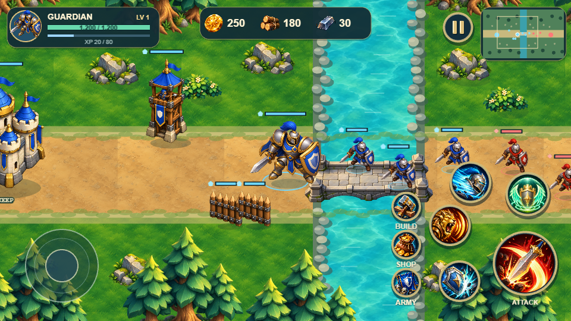
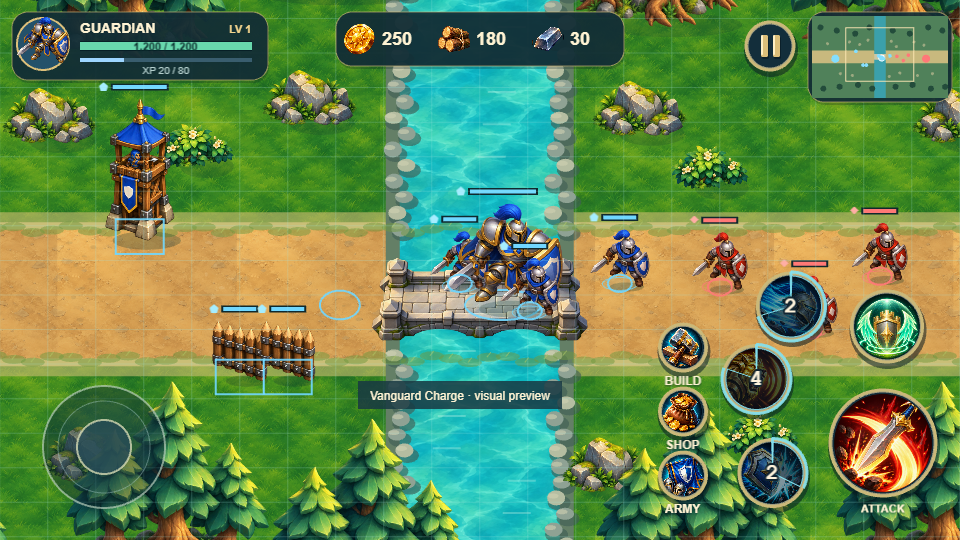
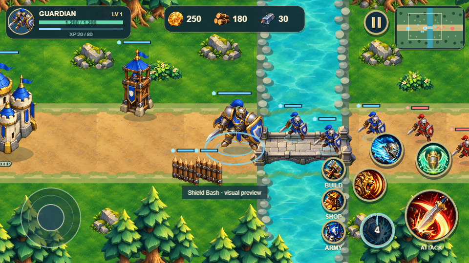
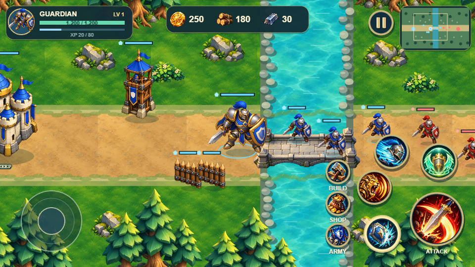
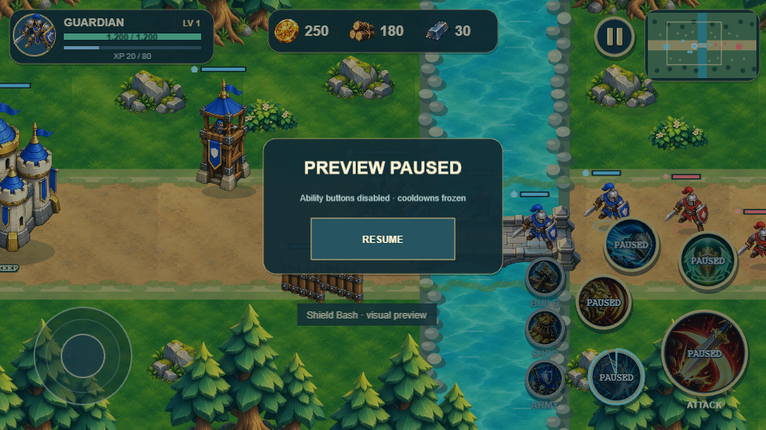
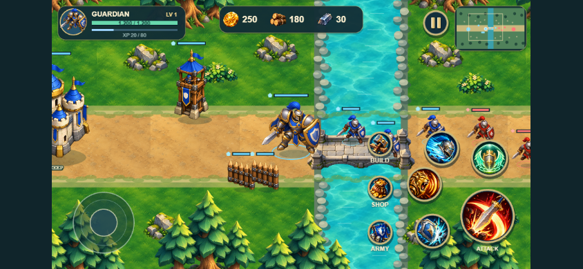

# Visual Prototype Verification

Verified on 8 October 2026 using installed desktop Google Chrome, Playwright, a WebGL renderer and software GPU rendering. These are actual browser tests and captures, not generated UI mockups.

| Check | Result |
|---|---|
| `npm run build` | Pass: strict TypeScript check and Vite static build |
| Dependency audit after patching Vite | 0 vulnerabilities reported |
| Local development boot (`5173`) | Pass, no runtime/console errors or missing assets |
| Production preview boot (`4173`) | Pass, no runtime/console errors or missing assets |
| Runtime requests | Local origin and local blob URLs only; no external dependencies |
| 960 × 540 battlefield | Captured and visually inspected |
| 844 × 390 landscape | Captured and visually inspected; standard skill targets 48.39 CSS px, utilities 48 CSS px |
| Close camera | View covers 960 × 750 logical units, less than the full map |
| Guardian movement / following | Hero and camera scroll change together; return to hero restores following |
| Camera boundaries | All four logical corners checked; viewport stays inside projected map |
| Terrain footprints | Water / tower / tree reject blocked positions; bridge strip accepts movement |
| Minimap | Hero marks match logical coordinates; taps survey a location; camera rectangle follows inverse projection |
| Grid toggle in Build | Shows independent logical footprints |
| Pause | Movement/cooldowns freeze; abilities become disabled |
| Joystick release / touch cancel | Motion stops and pointer ownership clears |
| Skill states | Pressed, cooldown and disabled screenshots; active cooldown rejects retrigger |
| Portrait guard | Rotation notice appears; presentation pauses |
| Three concurrent emulated touches | Joystick continues while Taunt and Charge are held; release activates both previews and clears pressed states |
| HUD ergonomics alignment | Top HUD preserved; utilities share one right-anchored column; bottom controls sit entirely in the right half; circular hit areas and visible rims do not overlap |
| HUD touch targets | All bottom controls at least 48 CSS px at both requested sizes and 667 × 320 / 568 × 320; Attack remains largest |
| Size hierarchy | Utilities 70% of standard skill diameter; skills slightly smaller at logical resolution; icon art preserved |
| Gesture clearance | Bottom hit areas reserve 24 CSS pixels in addition to safe-area insets |
| HUD safe-area constraints | Canvas and HUD stay inside simulated asymmetric 12/32/8/44 px insets |
| Utility states / cancellation | Pressed, pause-disabled, outside-release and pointer-cancel checked; invisible target edges open all three existing preview panels |
| Mobile mixed multitouch | Joystick + Build + Attack held simultaneously at 844 × 390; touch cancellation clears all without activation |
| Smaller landscape multitouch | Joystick + Attack at 667 × 320 and 568 × 320; outside release cancels Attack |

Machine-readable evidence: `verification.json` and `verification-production.json`. The repeatable browser check is `scripts/verify.mjs`.

Disc diameters exclude rim strokes and shadows. At 960 × 540: Attack 106 → 106, standard skills 70 → 67, sanctuary 74 → 71, utilities 68 → 46.9 logical pixels. At 844 × 390 these render at 76.56 / 48.39 / 51.28 / 33.87 CSS pixels respectively; utility touch targets are 48 pixels. At 320 pixels tall, primary art clamps to usable CSS sizes rather than continuing to shrink.

| Control | Center at 960 × 540 | Center at 844 × 390, in logical coordinates |
|---|---|---|
| Attack | 883, 443 | 873.77, 433.77 |
| Shield Bash | 772.5, 473 | 763.27, 463.77 |
| Lion Challenge | 756.5, 379 | 747.27, 369.77 |
| Charge | 791, 306.5 | 781.77, 297.27 |
| Sanctuary | 887, 326.5 | 877.77, 317.27 |
| Build | 683, 347.55 | 658.38, 288.86 |
| Shop | 683, 411.55 | 658.38, 377.47 |
| Army | 683, 475.55 | 658.38, 466.09 |

Coordinates follow the right/bottom anchors in `src/ui/controlLayout.ts`, not viewport-center offsets. No artwork was generated or replaced in this pass.

## Rendered screenshots

## Scope of evidence

No physical mobile device or Android WebView has been tested. Touch results are Chromium emulation. No performance target is claimed from software-rendered screenshots. Canvas fallback, actual safe areas, real device multitouch, short-screen readability and thermal behavior require later device review. Vite's large-chunk advisory remains because the bundled Phaser runtime is approximately 1.5 MB before compression.

Implementation references were checked against official [Phaser scale documentation](https://docs.phaser.io/phaser/concepts/scale-manager), [Phaser input documentation](https://docs.phaser.io/phaser/concepts/input), [Phaser camera documentation](https://docs.phaser.io/phaser/concepts/cameras) and [Vite relative-base build documentation](https://vite.dev/guide/build). Package versions are pinned and recorded in the lockfile.
