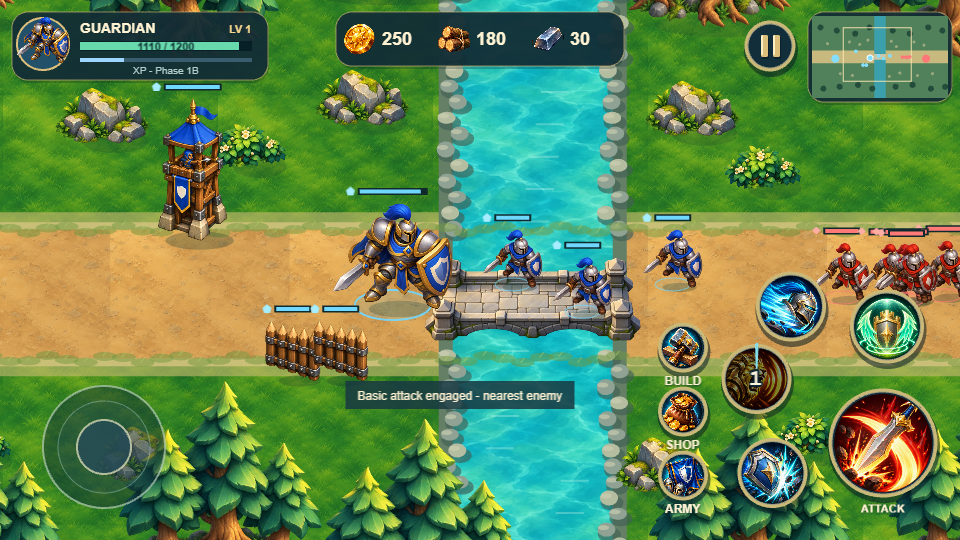
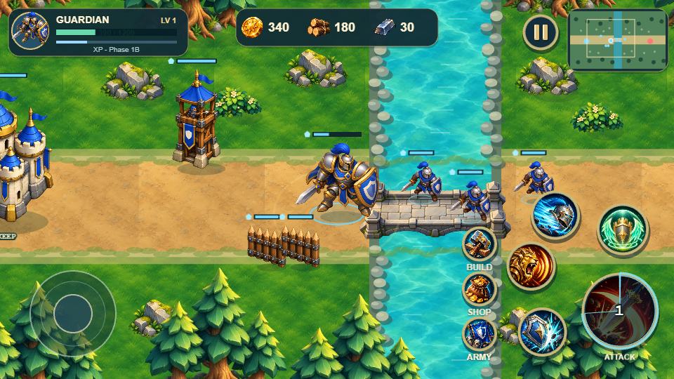
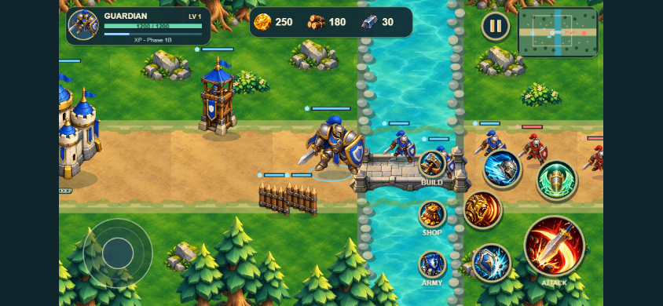
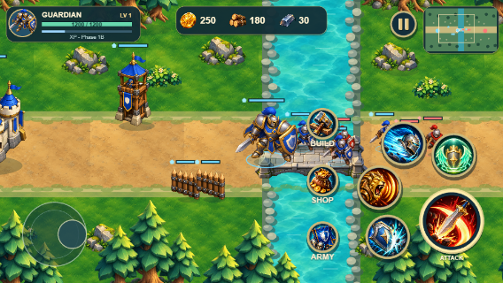

# Verification

Current Phase 1C: [implementation and verification report](PHASE_1C.md), [Phase 1B recovery/push evidence](PHASE_1B_RECOVERY.md). Run `npm test`, `npm run build`, `npm run verify:navigation`, `npm run verify:building`, and `npm run verify` with the appropriate local server/variant. Current reports are `phase1c-verification-{development,production}.json` and `phase1c/legacy/{development,production}/`; old Phase 1A/1B results below are preserved history.

Phase 1C initial results: 61/61 automated tests; TypeScript/Vite build and diff check passed; development and production each passed 13 Phase 1C, 24 construction and 52 regression browser checks, with no errors. Normal allied combat, intact-Wall rerouting, one-Wall breach/resume, exact HUD resources, determinism and lifecycle cleanup are recorded in the current reports. Physical devices and Android WebView are unverified.

Guardian collision follow-up: [fix and verification report](GUARDIAN_COLLISION_FIX.md). Run `npm run verify:collision` with the same server/variant settings. Reports are `guardian-collision-{development,production}.json`, with before-fix evidence in `guardian-collision-before.json` and screenshots in `screenshots/guardian-collision/`. Eleven added automated scenarios cover Guardian contact, crowds, melee reach, walls/bridges, determinism, death release and continued allied navigation.

Follow-up final results: 72/72 automated tests; build and diff check passed; development and production each passed 9 collision, 13 navigation, 24 construction and 52 regression browser checks. Guardian contacts remained at least 32 world units apart. Actual joystick/Attack controls, renderer alignment and unchanged 80-damage melee combat passed. Legacy restart readiness now waits for a new simulation instance; original lifecycle assertions remain intact.

Historical Phase 1B results and procedures: [Phase 1B report](PHASE_1B.md). See `phase1b-verification.json` and `phase1b-verification-production.json` for construction demonstrations; `phase1b-regression.json` and `phase1b-regression-production.json` record the Phase 1A regression checks on Phase 1B. Screenshots are in `screenshots/phase1b/`. The Phase 1A results below are the preserved baseline.

| Phase 1B check | Result |
|---|---|
| Headless tests | 43/43 passed, including all 22 Phase 1A tests |
| Production build | TypeScript and Vite passed |
| Phase 1A regression | 52 checks per development/production origin |
| Construction demonstration | 24 checks per development/production origin |
| Captures | 960x540 and 844x390, actual Chrome game rendering |

Browser verification covers valid Wall placement and one 25 Wood deduction, occupied-cell rejection without spending, Tower placement with 80 Wood/10 Iron deduction, real 18-damage Tower attacks, camera drag, state/HUD/render synchronization, pause/resume, cancellation, mobile joystick plus Attack, mobile Build targets, blur cancellation and scene restart. The separate destruction fixture adjusts HP/enemy attack data for deterministic render cleanup; headless tests cover the underlying damage/death rules. No physical mobile or Android WebView testing is claimed.

Verified on 8 October 2026 in desktop Chrome with Playwright, WebGL and software GPU rendering. Captures come from the actual game. Physical mobile devices and Android WebView were not tested.

| Check | Result |
|---|---|
| `npm test` | 22/22 headless tests passed |
| `npm run build` | Strict TypeScript and Vite build passed |
| Development browser, localhost:5175 | 52/52 checks passed |
| Production browser, localhost:4175 | 52/52 checks passed |
| Gameplay | Two three-minion waves defeated; six kills; Gold 250 -> 340 |
| Removal | Zero enemy units and zero enemy sprites after combat |
| Rendering | Real Guardian/enemy HP bars, logical positions and minimap marks |
| Lifecycle | Blur/portrait pause, cleared movement/attack intents, fresh input after resume |
| Scene restarts | Two restarts retain one command listener and reset HUD/simulation |
| Slow motion | Build -> Shop remains 0.25; closing restores 1 |
| Existing controls | Camera follow/bounds, minimap survey, footprints, skill previews and cancellation passed |
| Mobile emulation | 844x390, 667x320 and 568x320 layout/touch checks passed |
| Safe areas | Unequal simulated insets keep the canvas/HUD inside bounds |
| Runtime | No missing assets, console errors or external runtime requests |

The full browser suite passed 51 checks per origin; a targeted startup check additionally verified portrait boot, frozen ticks after rotation, and explicit Resume on both origins (52 total). The repeatable script includes that startup check.

The simulation tests cover render-rate determinism (including combat/death/respawn), delta clamp/catch-up cap, pause and zero/quarter time scale, normalized movement, swept collision, terrain/structure/scenery line of sight, invalid commands, windup/cooldown, target selection, attack cancellation, damage types/armor clamp, death/reward deduplication, enemy attacks, respawn, wave schedule, preview cooldowns, and headless operation without Phaser/browser imports or mutation of presentation definitions.

Reports: [development](phase1a-verification.json), [production](phase1a-verification-production.json). Repeat with `npm run verify` after starting the server; set `PROTOTYPE_URL` to the selected origin. Ports 5173/4173 were occupied, so this review used 5175/4175. Default run commands still use the original ports or the next available port.

Screenshots: `screenshots/phase1a/`. Original approved visual prototype captures and reports are retained separately.

Manual gameplay procedure, changed files, balance assumptions and current limitations: [Phase 1A report](PHASE_1A.md).

The Vite large-chunk advisory remains (bundled Phaser approximately 1.5 MB before compression). No performance, physical device reach, actual gesture navigation or Canvas fallback claim is made. Unit separation, arbitrary obstacle routing and production animations are deferred.

Implementation lifecycle handling follows the official [Phaser 3.90 scene events reference](https://docs.phaser.io/api-documentation/3.90.0/namespace/scenes-events). Approved scale/input/camera behavior and dependency versions were preserved.
